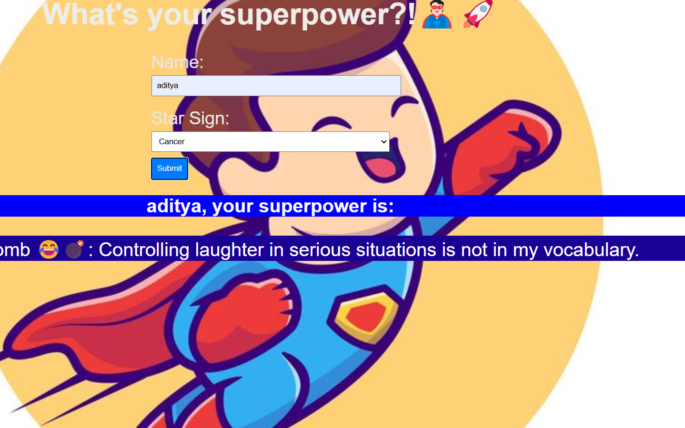

img width="1280" alt="readme-banner" src="https://github.com/user-attachments/assets/35332e92-44cb-425b-9dff-27bcf1023c6c">

# [what's your superpower?!] 🎯

## Basic Details
### Team Name: [innovateX]

### Team Members
- Team Lead: [Neha V] - [St joseph's college,devagiri]
- Member 2: [Aditya P] - [St joseph's college,devagiri]
- Member 3: [Liya fathima] - [St joseph's college,devagiri]

### Project Description
[if you give your name and star sign , it will assign certain useless superpower]

### The Problem (that doesn't exist)
[find our hidden useless superpower]

### The Solution (that nobody asked for)
[we generate their hidden superpowers based on their star sign]

## Technical Details
### Technologies/Components Used
For Software:
- [html,css,javascript]
- [Frameworks used]
- [Libraries used]
- [Tools used]

### Project Documentation
For Software:

# Screenshots (Add at least 3)

screenshot of our output screen

### Project Demo
# Video

https://github.com/user-attachments/assets/d80952f0-0d00-4cf4-91dc-5586642cae43

*its shows a useless superpower when you input your name and star sign*

## Team Contributions
- [Aditya p]: [javascript]
- [liya fathima]: [html]
- [Neha v]: [css]

